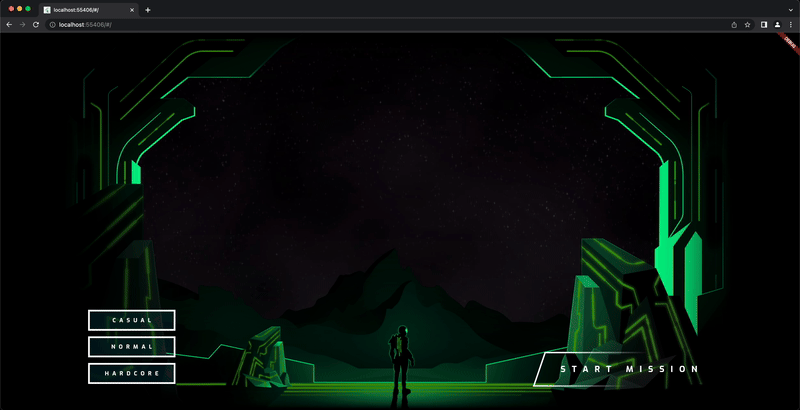

# Building next generation UIs in Flutter

- YouTube: [How to build next-gen UIs in Flutter](https://www.youtube.com/watch?v=HQT8ABlgsq0)
- [codelab](https://codelabs.developers.google.com/codelabs/flutter-next-gen-uis)
- [GitHub](https://github.com/flutter/codelabs/tree/main/next-gen-ui)

## Steps

### Get started

Add starter code

- [Go tag](https://github.com/gzupark/flutter-next-gen-ui/tree/step2-add-starter-code)
- [Go main](https://github.com/GzuPark/flutter-next-gen-ui)

### Paint the scene

Add assets to the scene

- [Go tag](https://github.com/gzupark/flutter-next-gen-ui/tree/step3-add-assets-to-the-scene)
- [Go main](https://github.com/GzuPark/flutter-next-gen-ui)

Add an image coloring utility

- [Go tag](https://github.com/gzupark/flutter-next-gen-ui/tree/step3-add-an-image-coloring-utility)
- [Go main](https://github.com/GzuPark/flutter-next-gen-ui)

Paint in color

- [Go tag](https://github.com/gzupark/flutter-next-gen-ui/tree/step3-paint-in-color)
- [Go main](https://github.com/GzuPark/flutter-next-gen-ui)

### Add a UI

Add a title

- [Go tag](https://github.com/gzupark/flutter-next-gen-ui/tree/step4-add-a-title)
- [Go main](https://github.com/GzuPark/flutter-next-gen-ui)

Add the difficulty buttons

- [Go tag](https://github.com/gzupark/flutter-next-gen-ui/tree/step4-add-the-difficulty-buttons)
- [Go main](https://github.com/GzuPark/flutter-next-gen-ui)

Add the start button

- [Go tag](https://github.com/gzupark/flutter-next-gen-ui/tree/step4-add-the-start-button)
- [Go main](https://github.com/GzuPark/flutter-next-gen-ui)

### Add animation

Fade in the title

- [Go tag](https://github.com/gzupark/flutter-next-gen-ui/tree/step5-fade-in-the-title)
- [Go main](https://github.com/GzuPark/flutter-next-gen-ui)

Fade in the difficulty buttons

- [Go tag](https://github.com/gzupark/flutter-next-gen-ui/tree/step5-fade-in-the-difficulty-buttons)
- [Go main](https://github.com/GzuPark/flutter-next-gen-ui)

Fade in the start button

- [Go tag](https://github.com/gzupark/flutter-next-gen-ui/tree/step5-fade-in-the-start-button)
- [Go main](https://github.com/GzuPark/flutter-next-gen-ui)

Animate the difficulty hover effect

- [Go tag](https://github.com/gzupark/flutter-next-gen-ui/tree/step5-animate-the-difficulty-hover-effect)
- [Go main](https://github.com/GzuPark/flutter-next-gen-ui)

Animate the color change

- [Go tag](https://github.com/gzupark/flutter-next-gen-ui/tree/step5-animate-the-color-change)
- [Go main](https://github.com/GzuPark/flutter-next-gen-ui)

### Add fragment shaders

Distorting the title with a fragment shader

- [Go tag](https://github.com/gzupark/flutter-next-gen-ui/tree/step6-distorting-the-title-with-a-fragment-shader)
- [Go main](https://github.com/GzuPark/flutter-next-gen-ui)

Add the orb

- [Go tag](https://github.com/gzupark/flutter-next-gen-ui/tree/step6-add-the-orb)
- [Go main](https://github.com/GzuPark/flutter-next-gen-ui)

### Add particle animations

Add particles everywhere

- [Go tag](https://github.com/gzupark/flutter-next-gen-ui/tree/step7-add-particles-everywhere)
- [Go main](https://github.com/GzuPark/flutter-next-gen-ui)

